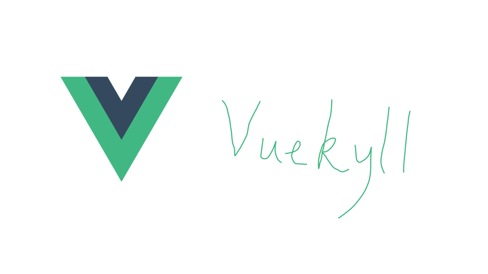

<h1 align=center>jekyll-theme-vuedocs</h1>
<p align=center>Start your new jekyll!</center>

**This is a good theme, but it is still in beta. Coming soon!**


#### What is `jekyll-theme-vuedocs`?
Vuedocs is a new jekyll theme with  nice interfaces. The interfaces may looks like Vuepress-setuped site.  
And of course, we also add some awesome features, we wish you will love this theme!

#### How to use
Clone this repository first and run this repository on your host!
```bash
git clone https://Github.com/SunbossRS/jekyll-theme-vuedocs.git
jekyll serve
```
... Doesn't know how to run Jekyll on your computer? [Click here](https://jekyllrb.com/) for help.

#### Contribution
Thanks for everyone to support this theme!  
Welcome you to send pull requests or issues, for the theme's better!

#### Using things in this project
- [Vue.js](https://vuejs.org/) support
- [Prism.js](https://prismjs.com/) code hightlights
- [jQuery.js](https://jquery.com/) support
- [SimpleJekyllSearch](https://github.com/christian-fei/simple-jekyll-search) searching service
- Comment system (quote)
  - [vssue](https://github.com/metrolxy/vssue/)
  - [gitalk](https://github.com/gitalk/)
  - [disqus](https://disqus.com/)
  - [valine](https://github.com/xcss/valine/)
  - [utterances](https://github.com/utterance/)

#### Features
- Code highlights
  - Support Php, C(like), Java, Html/Xml and the most useful language.
  - Use `prism.js`.
- Google Chrome navigation bar theme colour.
- Setup many comment system for your choose.
- *(Beta)* Manager panel platform.
- Support definiation page, and it is easy to write a definiation page, too.

#### About comment system
The comment system are all need to configure some external stuffs. The [`vssue`](https://vssue.js.org/), [`gitalk`](https://gitalk.github.io/) requires you to [create a OAuth Application](https://github.com/settings/applications/new) for comment, and go to `_config.yml` to input some information. But the [`utterances`](https://utteranc.es/) just only needs needs to [install a application](https://github.com/apps/utterances/) and then use it.  
The [`disqus`](https://disqus.com/) is the most famous comment system in blog. It is also good. But [`disqus`](https://disqus.com/) will be unusable in some country ...  
[`Valine`](https://valine.js.org) is so free in account username and it support emoji. But it needs to [create a application in LeanCloud](https://leancloud.cn/dashboard/applist.html#/newapp).

#### Todo
- [ ] New style of the homepage
- [ ] Administrator management module

#### License
**This open source project has standing under MIT license.**
